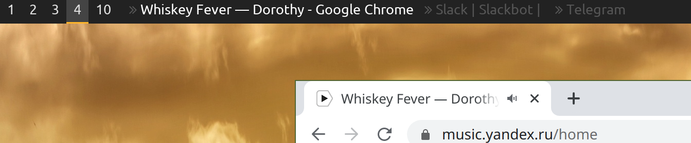

Tools for i3wm
==

cmd/scratches
--
This tool allows you to display your scratchpad windows in polybar. When you click their names in bar, you toggle them.



For each of your scratchpads add this section in polybar config:
```
[module/scratch-SCRATCHPAD_NAME]
type = custom/script
exec = scratches -s SCRATCHPAD_NAME
label = %output:0:20:...%
format =  <label>
format-foreground = ${colors.foreground-alt}
click-left = scratches -s SCRATCHPAD_NAME -op toggle
```